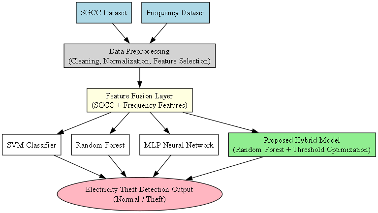
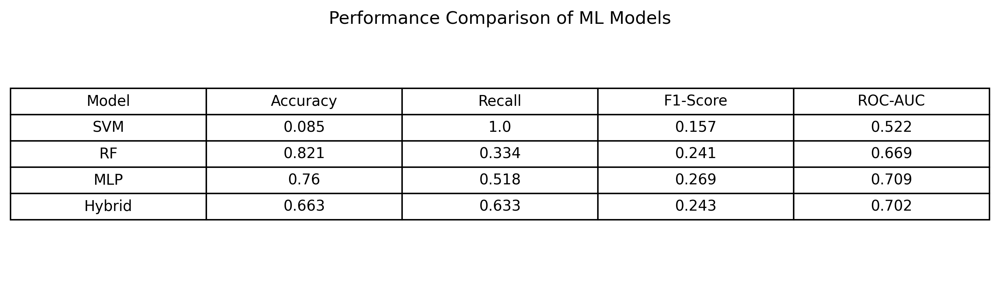
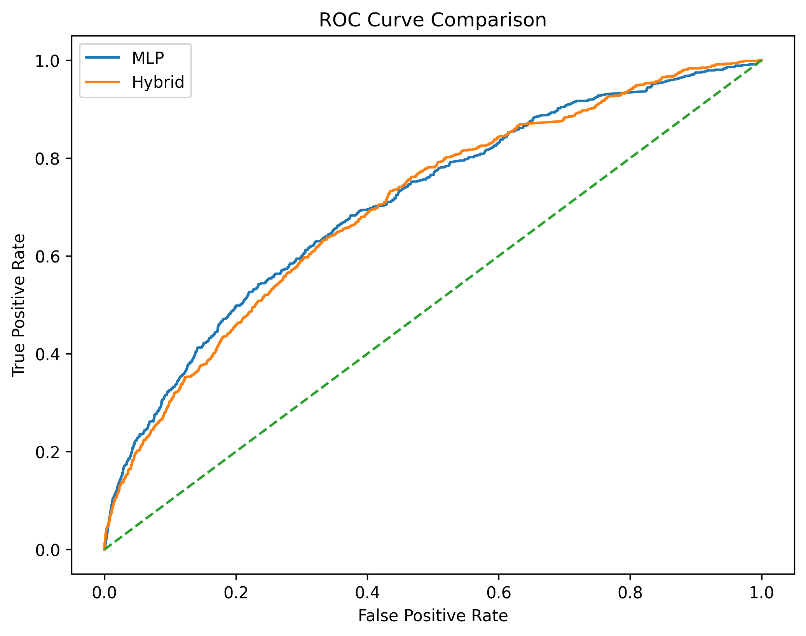
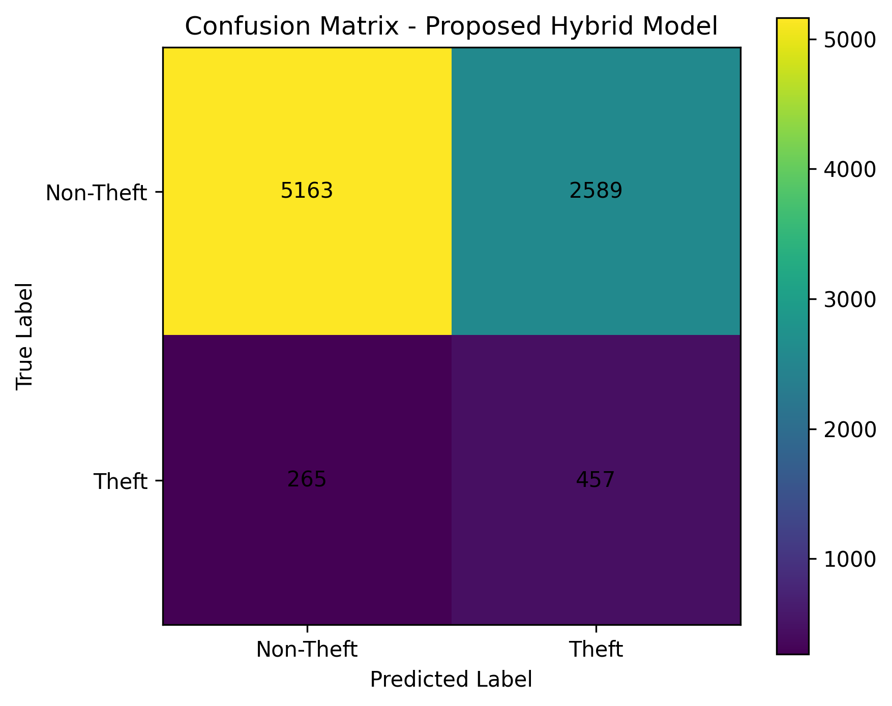
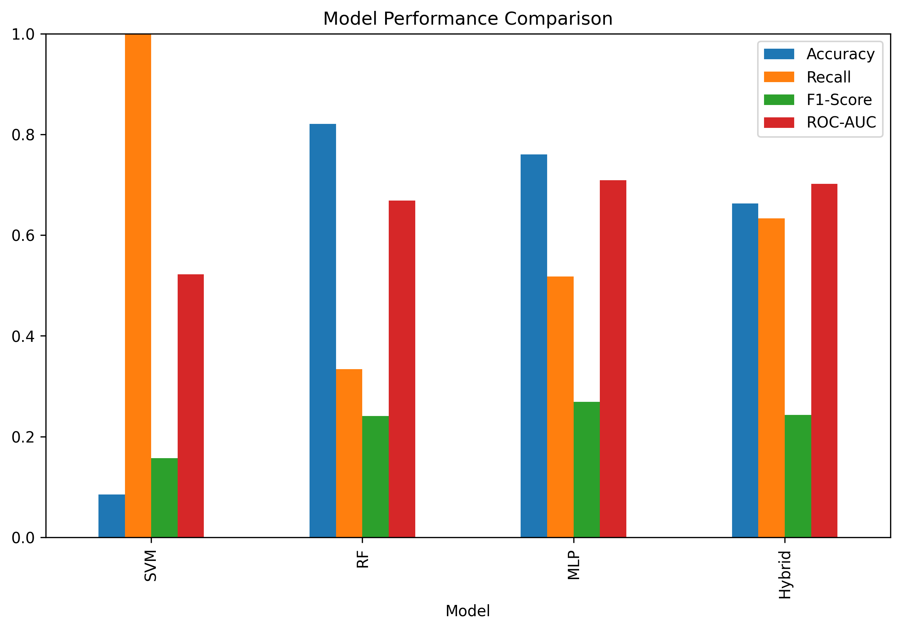
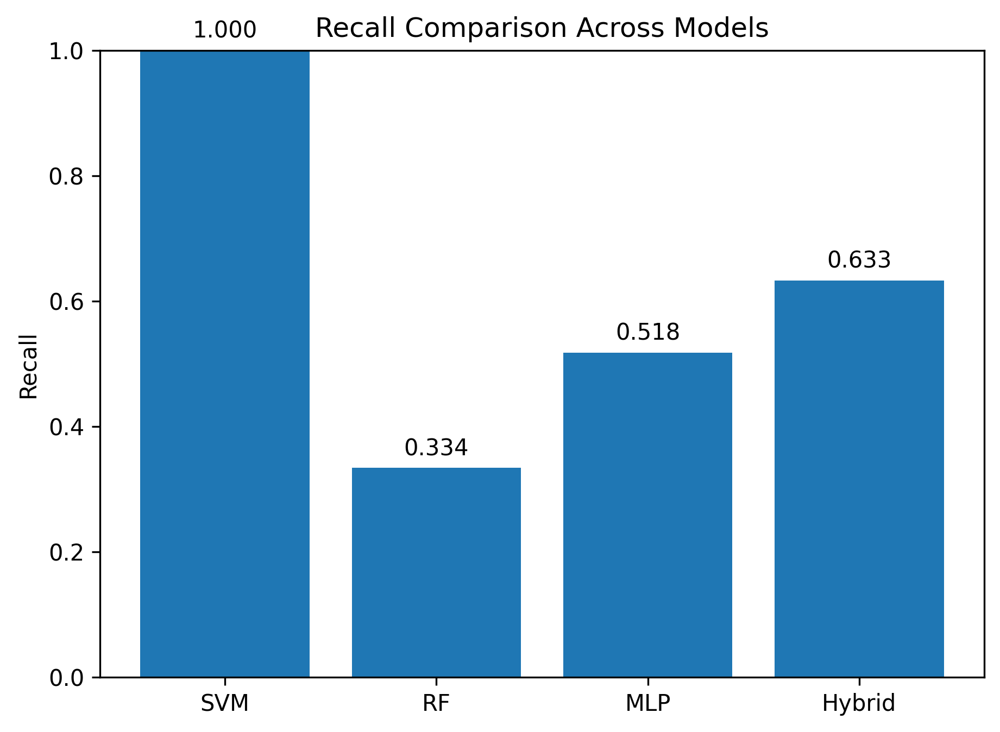

# Hybrid Machine Learning-Based Electricity Theft Detection in Smart Grids Using Load and Frequency Features


---

## Overview

Electricity theft is a major challenge for modern power systems, causing revenue losses, operational inefficiencies, and reliability concerns for distribution networks.

This repository presents a hybrid machine learning framework for electricity theft detection in smart grids by integrating smart meter load behaviour features with power system frequency characteristics derived from grid measurements.

The proposed approach combines **Random Forest (RF)** and **Multi-Layer Perceptron (MLP)** classifiers through a weighted probability fusion strategy to improve detection performance under imbalanced smart meter data conditions.

---

## Research Contributions

The main contributions of this work include:

- Development of a hybrid Random Forest and Multi-Layer Perceptron (RF-MLP) electricity theft detection framework.
- Integration of smart meter load characteristics with frequency-based grid features.
- Feature engineering pipeline for electricity theft classification.
- Handling of class imbalance using Synthetic Minority Oversampling Technique (SMOTE).
- Comparative evaluation of individual and ensemble machine learning models.
- Development of a reproducible Python-based research workflow.

---

# Methodology

The proposed framework follows the workflow below:

## Methodology Workflow



# Machine Learning Framework

The implemented models include:

### Support Vector Machine (SVM)

Used as a baseline classification model to evaluate conventional machine learning performance.

### Random Forest (RF)

A tree-based ensemble learning algorithm used for robust classification and feature learning.

### Multi-Layer Perceptron (MLP)

A neural network-based classifier used to capture complex nonlinear relationships within smart grid data.

### Hybrid RF-MLP Ensemble

The proposed model combines Random Forest and MLP probability outputs using weighted fusion:

- Random Forest contribution: 60%
- MLP contribution: 40%

The final prediction is generated using the optimised classification threshold obtained from ROC analysis.


# Repository Structure

```
hybrid-electricity-theft-detection/

├── data/
│ └── README.md
│
├── notebooks/
│ └── README.md
│
├── src/
│ ├── main.py
│ ├── preprocessing.py
│ ├── feature_engineering.py
│ ├── train_model.py
│ ├── evaluate.py
│ ├── utils.py
│ └── README.md
│
├── figures/
│ └── workflow.png
│
├── results/
│ ├── model_comparison.csv
│ ├── model_comparison_table.png
│ ├── bar_comparison.png
│ ├── recall_comparison.png
│ ├── roc_curve.png
│ └── confusion_matrix_hybrid.png
│
├── requirements.txt
├── LICENSE
└── README.md
```

---

# Dataset

This research uses smart grid electricity consumption data combined with frequency-related grid information.

Due to dataset licensing restrictions, the original datasets are not included in this repository.

The implementation expects the processed datasets to be placed in the data directory:

- SGCC smart meter dataset
- Frequency feature dataset

Dataset preparation instructions are documented in data/README.md.

---

# Installation

Clone this repository:

```bash
git clone https://github.com/vpthesizzler/hybrid-electricity-theft-detection.git
```

Navigate to the project folder:

```bash
cd hybrid-electricity-theft-detection
```
Install required dependencies:

```bash
pip install -r requirements.txt
```


Run the complete pipeline:


```bash
python src/main.py
```
---

# Requirements

The project was developed using:

```
Python >= 3.10

numpy
pandas
scikit-learn
imbalanced-learn
matplotlib
joblib
```

# Results

The proposed framework is evaluated using:

- Accuracy
- Precision
- Recall
- F1-score
- ROC-AUC
- Confusion Matrix

### Model Performance Comparison



### ROC Curve



### Confusion Matrix



### Performance Comparison



### Recall Comparison




# Visual Results

The repository contains:

- Model workflow diagram
- Confusion matrix
- ROC curve
- Performance comparison plots
- Recall comparison analysis

---

# Future Extensions

Future development directions include:

- Explainable Artificial Intelligence (XAI) using SHAP.
- Federated Learning-based privacy-preserving detection.
- Digital Twin integration for smart grid resilience.
- Real-time electricity theft monitoring systems.

---

# Publication

**Title:**

Hybrid Machine Learning-Based Electricity Theft Detection in Smart Grids Using Load and Frequency Features

**Author:**

Vrushabh Patil

**Status:**

Under Review

**Citation:**

```
Vrushabh Patil,
"Hybrid Machine Learning-Based Electricity Theft Detection in Smart Grids Using Load and Frequency Features",
Under Review.

**Repository:**
https://github.com/vpthesizzler/Hybrid-Electricity-Theft-Detection

```

---

# Author

## Vrushabh Patil

MSc New and Renewable Energy
Durham University

Research Interests:

- Smart Grid Security
- Artificial Intelligence for Energy Systems
- Machine Learning Applications
- Electricity Theft Detection
- Renewable Energy Integration

---

# Acknowledgements

This work acknowledges the contribution of open-source Python machine learning libraries:

- Scikit-learn
- Pandas
- NumPy
- Matplotlib

---

# License

This project is licensed under the MIT License.

---

# Contact

For research collaboration or technical discussions, please contact:

**Vrushabh Patil**
